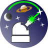

Hathor web app
==============

Below are the instructions for using the Hathor web app. [The hathor.js code documentation](https://htmlpreview.github.io/?https://raw.githubusercontent.com/jocoteles/Stellector/main/hathor/out/index.html) was generated with JSDoc.

To access *Hathor* web app via ClouFlare's CDN, [click here](https://rawcdn.githack.com/jocoteles/Stellector/446829e5dc1aeb43d528b2b9b58800cc3d9925e9/hathor/index.html).

## 1. Communication (*Comm*) window

  
   
  <b>Figure 1.</b> <em>Communication window.</em>

When one clicks on the *Start or Restart communication* button, the communication via Bluetooth protocol starts (a web browser compatible with the Web Bluetooth API must be used). In this window there is also a log text field, in which all commands sent to Horus and all information read from it are notified. It has a more technical function, useful for users interested in more detailed operation of the equipment and for controlling any software failures. The Comm window is only used once when the equipment is started. Occasionally, there may be a loss of communication between Horus and Hathor, making it necessary to re-establish communication via the *Start or Restart communication* button.

## 2. Calibration (*Calib*) window

### 2.1 *Controller* tab

  
   
  <b>Figure 2.</b> <em>Controller tab.</em>

This is the manual control for laser movement. It has 4 directional buttons: fixed motor in the right and left hand directions, and mobile motor in the up and down directions. Below the directional buttons there is a slider for the size of the angular displacement of the motor shaft at each click of the directional buttons, which can take on values of 1, 2, 4, 8, 16, 32, 64 or 128 steps. Remembering that each step of the motor is approximately 0.18º. Finally, to the right of this control there is a button for turning the laser light on or off. Due to its importance, this *Controller* tab is also available in other windows.

### 2.2 *Calibration Setup* tab

  
   
  <b>Figure 3.</b> <em>Object Selection in Calibration Setup tab.</em>

 The Object Selection in *Calibration Setup* tab has four fields to search for the desired calibration star: (i) *Name*, to search for the star's western proper name, (ii) *Cons*, for search for the western name of the constellation to which the star belongs, (iii) *HIP* for the Hipparchus code of the star and (iv) *HD* for the HD code of the star. In the case of selection by Solar System objects (basically the Moon and the planets), only the field *Name* provides identification of the object. When typing the first 3 characters of any of the four fields, the application filters all stars that fit these characters and displays them in the selection box identified by *Object selected*. Finally, this tab has the *ADD CALIB OBJECT* button, which must be activated when the laser is pointing at the chosen star in the *Object selected* selection box. By clicking on this button, the selected star is added to the *Calibration List* field discussed below.

 The Calibration List field contains the list of celestial objects already chosen for calibration. To the right there are buttons *remove this* for removing a particular star from the calibration list and *remove all* for removing the entire list. After the inclusion of two or more stars in this list, it is possible to calculate the calibration of the orientation of the Horus local coordinate system, which is done by clicking on *CALC* button. The result of this calibration is displayed in the *Calibration Log* tab. If the user considers that the calibration was successful, he clicks on *ACCEPT* button, making any navigation command from then on take into account the orientation obtained from this calibration.

### 2.3 *Actual Calibration Info* and *Log* tabs

 

  
   
  <b>Figure 4.</b> <em>Actual Calibration Info and Log tabs.</em>

*Actual Calibration Info tab.* It displays a text field with the information of the stars used in the current calibration obtained by pressing the *ACCEPT* button.
    
*Calibration Log tab.* It displays a text field with information on all calculated calibrations, including those that were not chosen by the *ACCEPT* button.

## 3. Navigation (*Nav*) window

### 3.1 *Sky Objects* tab

  
   
  <b>Figure 5.</b> <em>Sky Objects tab.</em>

Within this tab one can point to individual celestial objects. The *Object Type* options are: (i) solar system (with equatorial coordinates calculated by the orb.js library), (ii) star, (iii) deep sky and cluster, (iv) messier and (v) constellation center (with equatorial coordinates obtained from the d3-celestial javascript library). Then, the object is selected by typing the first letters in the *Object filter* field, similarly to what was explained in the calibration window. The selection box *Pointer style* allows one to choose the option *point* which corresponds to the laser to remain fixed exactly on the coordinate of the star and the option *circle* which corresponds to the laser to execute a circular movement around of the star. By pressing the *go Now* button, the laser is pointed at the currently selected star at the current moment. By pressing the *go DateTime* button, the laser is pointed at the object at the chosen *Date* and *Time*. In addition, it is possible to temporally advance and rewind the position of the object through a pre-chosen *Time step* with the *step Past* and *step Future* buttons. When taking the steps, it is possible to disregard sidereal movement by checking the *sidereal offset* option. This is an especially useful option for showing the movement of solar system objects relative to the "fixed" stars.

### 3.2 *Sky Tracks* tab

  
   
  <b>Figure 6.</b> <em>Sky Tracks tab.</em>

The purpose of this tab is to navigate and trace lines and boundaries involving the constellations, asterisms and the ecliptic. With it, it is possible to make the cyclical tracing, or one step at a time, among the stars of the chosen constellation or asterism, allowing a wide visualization of the sky region and the set of stars covered by the constellation. Tracings can be taken at the current moment or at the positions occupied by the stars in the chosen Date and Time.

### 3.3 *Coordinates* tab

  
   
  <b>Figure 7.</b> <em>Coordinates tab.</em>

In this tab it is possible to check or access the coordinates directly, without the need for them to be associated with the position of a particular celestial object. The units of the spherical coordinates indicated for the laser can be in *steps*, which correspond to the number of steps of the fixed (Fix) and mobile (Mob) motor, or *equatorial*, which correspond to the equatorial coordinates RA (Right Ascension) and Dec (Declination). The *go Equatorial* and *go Steps* buttons guide the laser to the chosen equatorial coordinate or step motor coordinate, respectively. The *read Coords* button reads the coordinates in which the laser is positioned and the *go Zenith* button automatically takes the laser to the zenith direction using the reading of the GY-521 accelerometer fixed to the laser case.

## 4. *Find* window

This is the only window that has not yet been implemented. The purpose is to display information about the region of the sky that the laser is pointing to. In a sense, it has the opposite functionality of the Nav window.

## 5. Configuration (*Config*) window

  
   
  <b>Figure 8.</b> <em>Pointer and Speech config tabs.</em>

*Pointer Config.* In this tab, one can choose the laser linear and circular tracing speed, the circular aperture angular radius, among other tracing parameters.

*Speech Config.* Here, one can choose to have the Hathor app pronounce the name and designations of celestial objects as they are traversed by the laser using the *step Back* and *step Forw* buttons on the *Sky Tracks* tab of the *Nav* window.

  
   
  <b>Figure 9.</b> <em>Calibration and Controller config tabs.</em>

*Calibration Config.* In this tab, additional parameters to be optimized in the calibration of the Horus coordinate system are considered. The *fix* and *mob angle stretching* parameters allow one to apply a multiplicative factor to the angular size of each step of the step motors. This may be necessary due to the tension produced by the torsion springs used to avoid the step motor missteps. The *laser* and *mob axis tilt* parameters allow for a correction in the angle between the laser direction and the mobile motor axis and between the mobile motor axis and the fixed motor shaft. Ideally, both angles are 90°, but constructive failures and stresses in the supports can produce small deviations from that.

*Controller Config.* Allows one to choose the width that the step motor control occupies in the *Controller* tab.