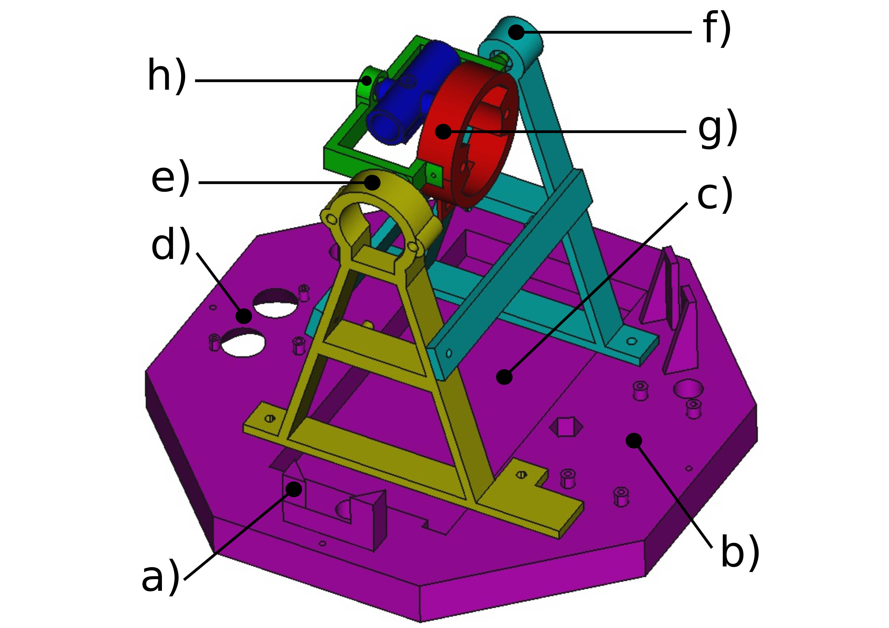
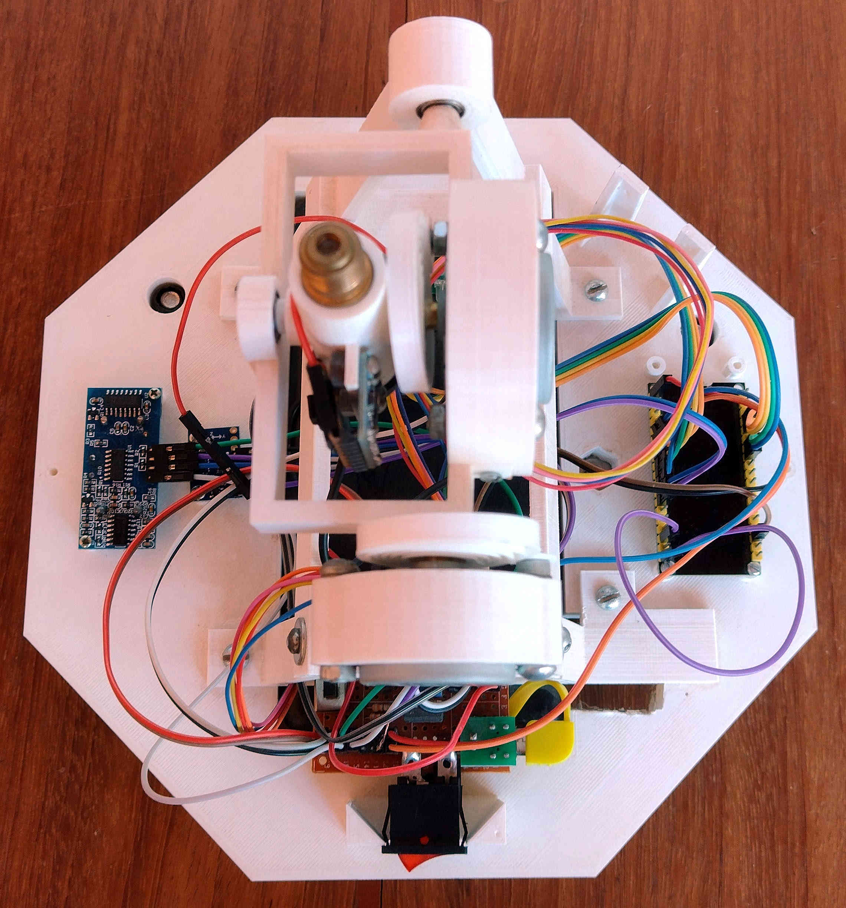
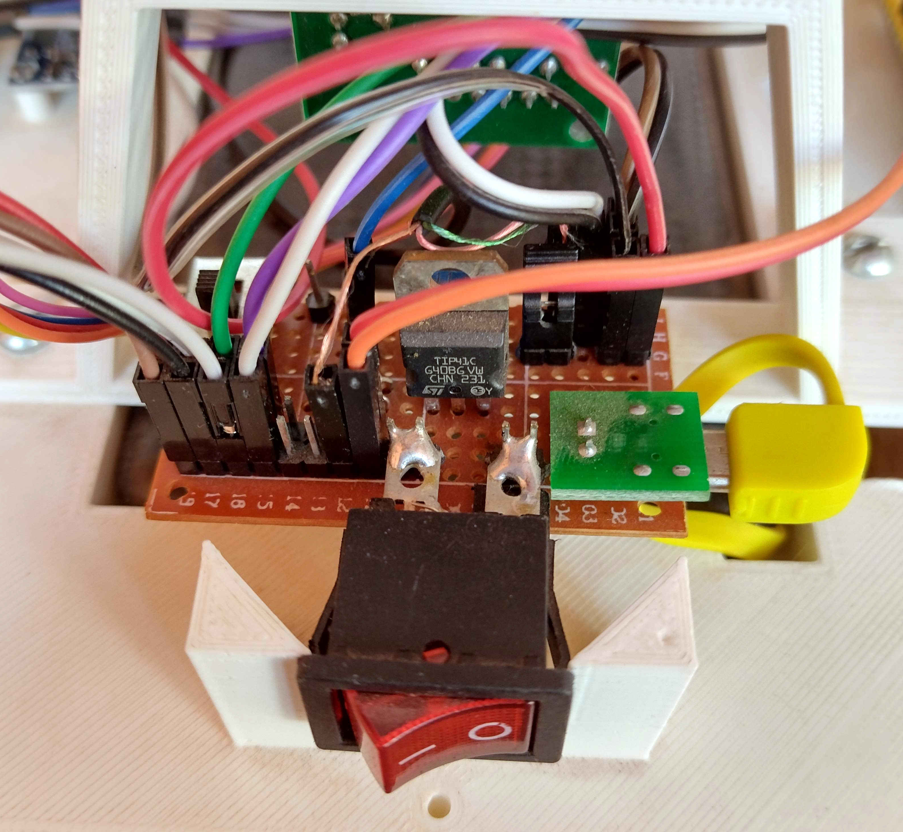
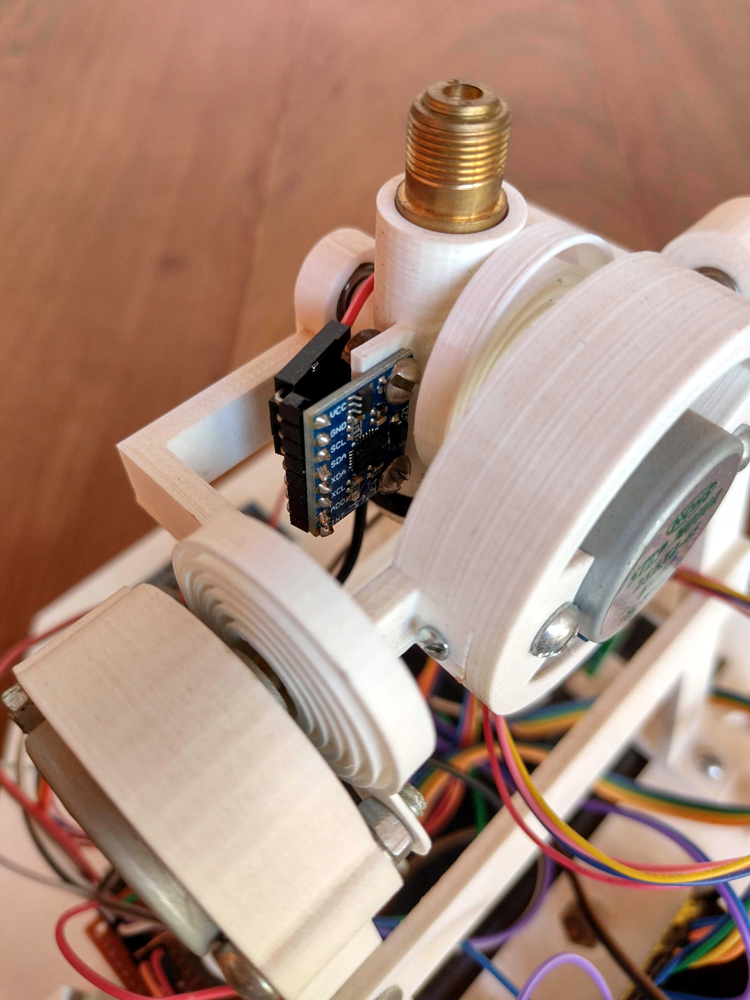
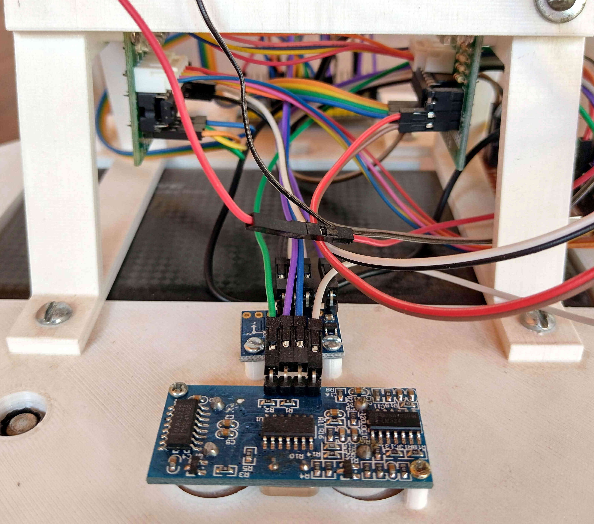
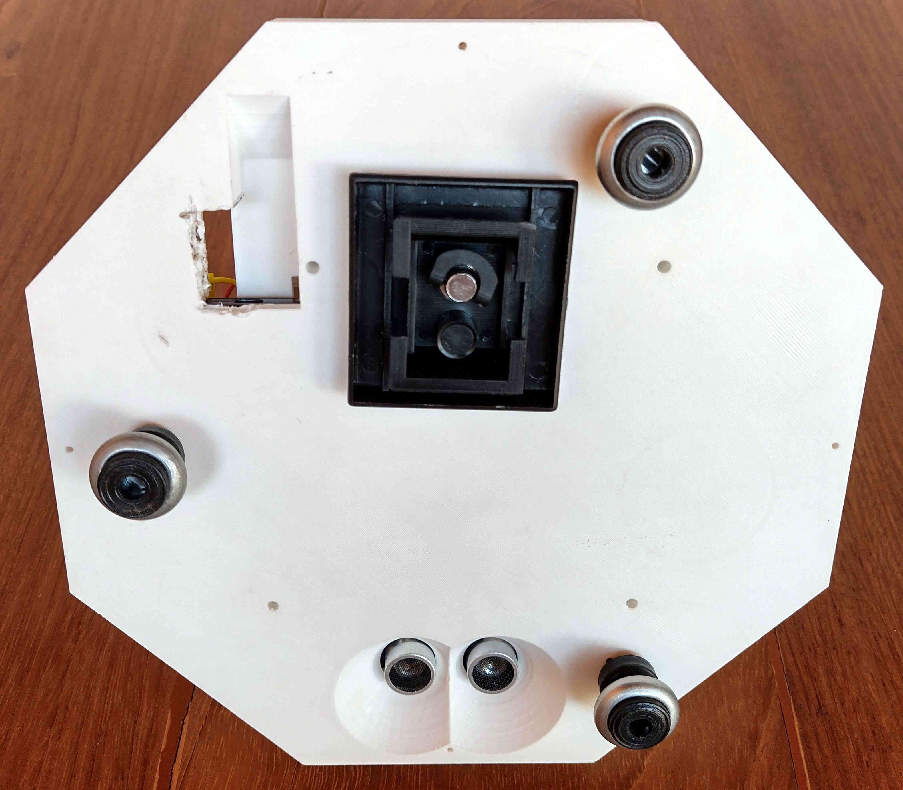
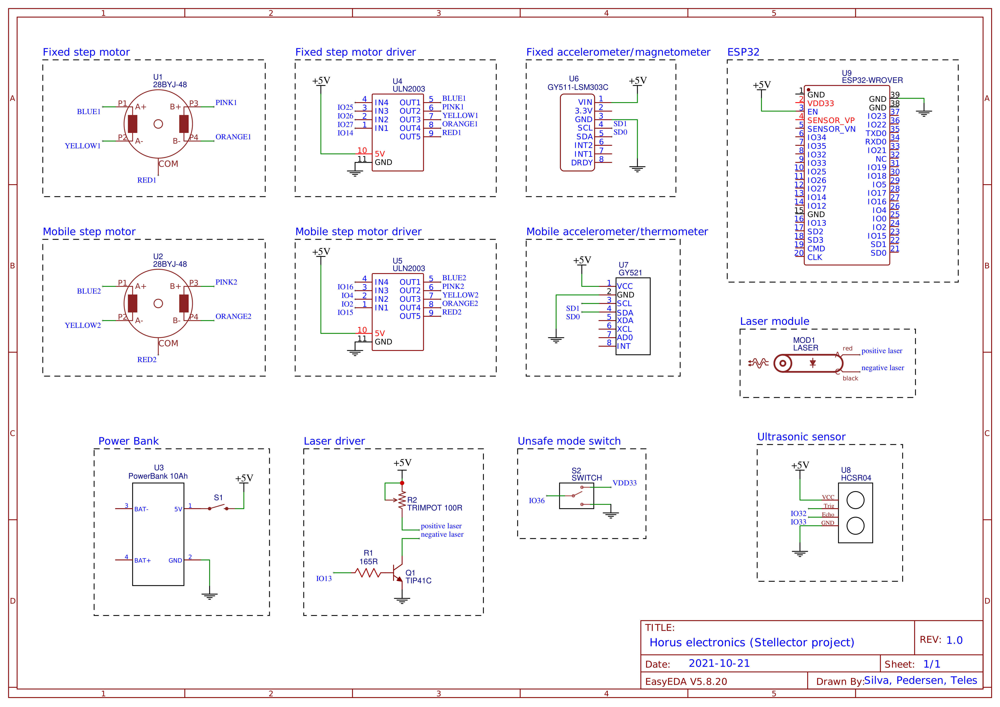

# Horus hardware

## 1. Mechanical structure

  
   
  <em><b>Figure 1.</b> Horus perspective view rendered with FreeCAD. a) Power switch and power distribution circuit fitting. b) ESP32 board location. c) Power bank socket. d) HC-SR04 ultrasonic sensor socket. e) Triangular shaped tower to hold the fixed step motor. f) Triangular shaped tower to hold the mobile step motor support shaft. g) Mobile step motor fitting. h) Laser support shaft fitting. Each colored part must be printed separately. We have been using PLA filament with good results. 3D printed parts are connected to each other with common metal screws.</em>

 

  
   
  <em><b>Figure 2.</b> Horus top view. Clockwise, starting from the right side, we have: (i) the ESP32 board, (ii) the power switch and electric power distribution circuit and (iii) HC-SR04 ultrasonic sensor and GY-511 accelerometer. In the center, from top to bottom, we have: (i) the step motors, (ii) the laser and the GY-521 accelerometer, (iii) the stepper drivers and (iv) the poer bank.</em>

 

  
   
  <em><b>Figure 3.</b> Power switch and electric power distribution circuit closeup. A perforated plate with copper islands measuring 51 mm x 29 mm is used. The board is soldered and supported by the power switch which is fitted into the socket. This circuit is responsible for receiving the powerbank power (micro USB in yellow), for distributing the power to all the Horus electronics and electromechanics, to drive the laser from the ESP32 digital output and to hold the safe/unsafe mode of operation switch which is connected to one of the ESP32 digital inputs.</em>

 

  
   
  <em><b>Figure 4.</b> Horus top part components closeup. The metal housing of the laser module extracted from a laser pointer is fitted into the cylindrical socket. This same socket has an appendix for fixing the GY-521 accelerometer that serves to determine the direction of the local zenith. We also see the fixed step motor in the lower left corner and the mobile stepper in the center right. Step motors are securely fastened to their sockets using metal screws and bolts. The end of the spring is attached to one of the motor fixing screws. The step motor support shafts are connected to their sockets by bearings with 9.45 mm and 4.55 mm outer and inner diameters, respectively.There is a flat torsion spring attached to the shaft of each motor. They serve to keep the stepper shaft tensioned in order to avoid false steps when changing the stepper rotation direction. </em>

 

  
   
  <em><b>Figure 5. </b> HC-SR04 ultrasonic distance sensor and GY-511 leveling accelerometer closeup. These two sensors are used to ensure that the Horus is at a safe distance from the ground and horizontally leveled. These conditions avoid the risk of the laser getting into people's eyes during exposure. In the upper part of the figure we also see the ULN2003 driver of each stepper bolted to the horizontal bar of the triangular towers.</em>

 

  
   
  <em><b>Figure 6.</b> Horus bottom view. There is a socket in the Horus base for a hex nut that is used to secure Horus base to a tripod. Alternatively, there are also three 11.25 mm diameter holes for attaching leveling feet.</em>

 

## 2. Electric circuit diagram

  
   
  <em><b>Figure 7.</b> Horus electric circuit diagram.</em>

 

